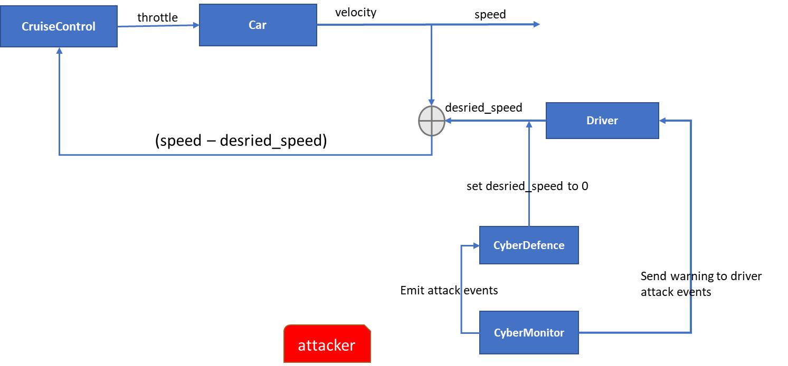
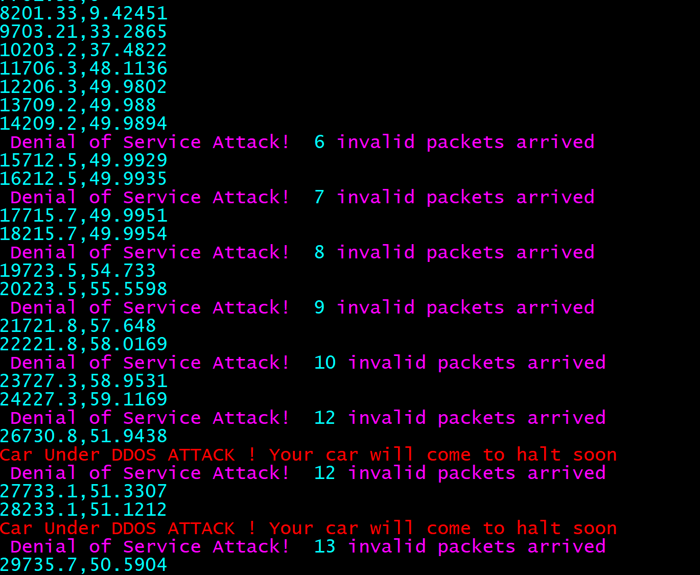

Securing Elam's Cruise Control from Cyber Attack
===

ELMA
----
[Elma](http://klavinslab.org/elma/) is an event loop and process manager for embedded and reactive systems. Elma is structured as a C++ library of classes on top of which you build your own C++ project. It keeps track of processes, finite state machines, events, and communication channels, executing them at specified frequencies. Elma was developed as part of the University of Washington's [ECE P 520 course](https://github.com/klavins/ECEP520) on advanced embedded systems programming. More information on how Elma was designed can be found in the links below:
- [Event loop management](https://github.com/klavins/ECEP520/tree/master/week_6)
- [Events and finite state machines](https://github.com/klavins/ECEP520/tree/master/week_7)
- [HTTP in event loops](https://github.com/klavins/ECEP520/blob/master/week_8)

 

About This Project
--------
With the widespread adaptation of Autonomous vehicles, cyber security is  of utmost value. This is a fun project intended to extend ELMA's functionality. This project is based on [Elma](http://klavinslab.org/elma/). In the project I'll demonstrate how to implement a cyber defence mechanism against commonly known network layer attacks. We'll specifically implement defence and protection mechanism against DoS and D-DoS attacks. The project demonstrates how two separate docker images can communicate via Elma's event and process. 

**Installation**
-------
[Elma](http://klavinslab.org/elma/) source code along with the driving example is used for this project. Follow the steps below for the installation. 

    git clone https://github.com/mulugetakem/elma.git
    cd elma
    docker run -v $PWD:/source -it klavins/elma:latest bash
    make
    cd finalproject
    make

**Execution**
--
To simulate a DoS attack, you would need to start another instance of the same docker image. This second container will be used to simulate a DoS attacker. You can add more instances to emulate a DDoS attack. 

    docker run -v $PWD:/source -it klavins/elma:latest bash
on the primary docker image run the following code to get the IP address of the docker so that you can send ping (ICMP Flood) from the secodary docker image. 

    ip a | grep -oE "\b([0-9]{1,3}\.){3}[0-9]{1,3}\b" | grep 172.17

notice the IP address you get here. it usally starts with 172.17.x.x 

Go to the main(primary) container and run the following command

    ./bin/driving_cyberdefence
The command above is used to start the car and cyber monitor. You can now send ICMP packets from the other secondary container (`ping 172.17.x.x`) and the behaviour is:
- If the ICMP packets coming into the car is small then nothing happens
- if the ICMP packets coming into the car is greater than a certain threshold (>5 in this case :smile: ) . Then the driver is warned about a possible ICMP packet
- If the ICMP packets coming into the car is much higher and threatening (>10 in this case :smile: ) . A posiive feedback is applied and the car will be slowly brought to stop. 

**Architecture**
--
Two additional class have been implemented on top of driving class. The CyberMonitor class plays the main role in communicating and analysing the packets coming into the car. The snippets below are used to create a socket , receive packets from the secondary docker image and process the ip header of the packet for further analysis:

    
        while(1)       
    
               {
                   //insert the select() variables for the timeout here
                   FD_ZERO(&readfds);
                   FD_SET(sock_raw, &readfds);
                   timeout.tv_sec=1;
                   timeout.tv_usec=0;
                   sret = select(sock_raw + 1,&readfds,NULL,NULL,&timeout);            
                   saddr_size = sizeof(saddr);
                   //the value of k<2 helps to break the loop and go back to the cruisecontrol

                   if(sret == 1 && k<2)
                   {
                   data_size = recvfrom(sock_raw,buffer,65536,0,&saddr,&saddr_size); 
                          
                   icmpcount =  ProcessPacket(buffer,data_size);
                  }

                   else   //if (k==0 || k>2)
                    break;
                  
                    k++;
               }
In the code above the select() function is used to poll the remote connection for any availalbe data. If none then the while loop exits and shows the execution of cruisecontrol. 

Also the `ProcessPacket(buffer,data_size)` is implemented as shown in the snippet below:
 
    int ProcessPacket(unsigned char* buffer, int &size)
    
             {
                struct iphdr *iph = (struct iphdr*)buffer;                
                 switch(iph->protocol) //check the protocol. If the value = 1 then it's an ICMP packet which is used by DoS attackes. 
            
                {
                    case 1:
                        ++icmpcount;  
                        break;
                }
                return icmpcount;  //return the total number of packets being received so that the monitor decides how much danager it poses 
             } 

The figure below shows block diagram representation of the implementation. 

**Results**
---
Below is result of executing the code where receiving 5 packets assumed to start overwhelm the car opration and more than 10 packets forces the CyberDefender to stop the car. As can be seen on the output after the 10th packet the car start to decelerate. 

**Improvments and future work**
--
- Improve the user interface via `ncurses` library => *In Progress*
- Move the solution to Elma extended example format => *in Progress*
- Add aditional Network Layer attack types such as `TCP SYNC` and `jamming` attacks.
- Make the attack scenarios more realistic by increasing the number of packets arriving in a specific duration. 

This software is open source and uses the MIT license. Details can be found [here](https://github.com/klavinslab/elma).
